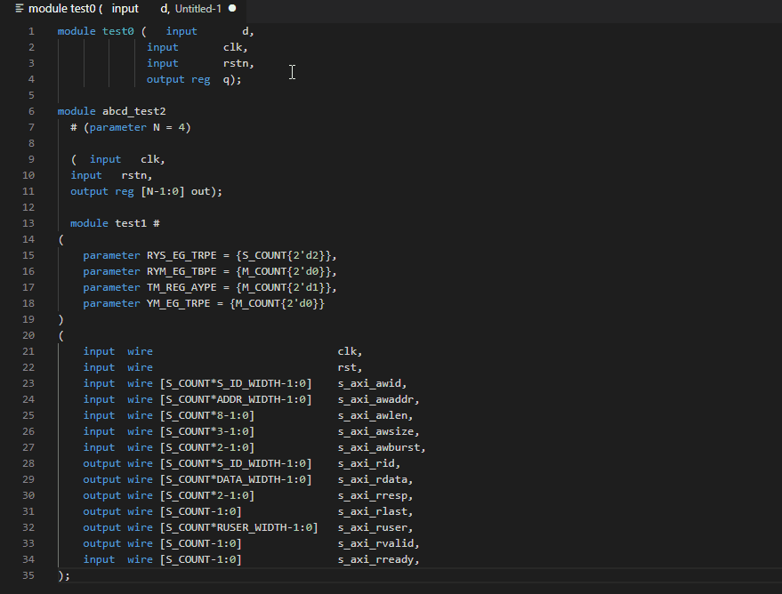

# verilog-utils README

verilog utility functions.

## Features

There is only one feature now.
- Make instatiation code

## Examples
- Command Name : "Verilog Utils - Instation"

## TODO
- Verilog snippet
- instantiate Align